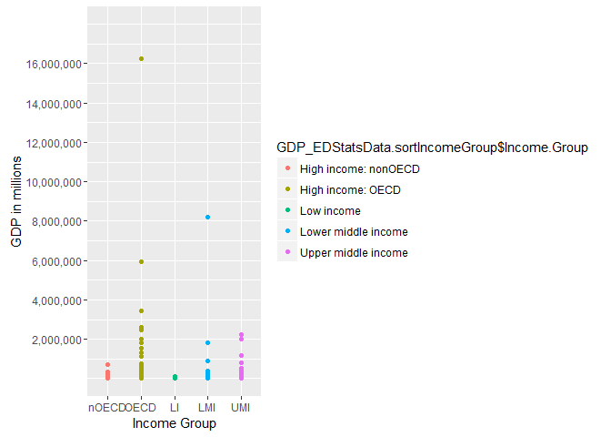

# Analysis of GDP and Income Group
Sandhya Amaresh  
June 22, 2016  


## R Markdown

The following analysis and plots are performed on 2 data sets. The first data set is the GDP data for 2014 for 190 countries sourced from world bank. The second data set is Educational Stats which holds around comparable indicators that describe progression, income group, expediture of the various countries. This data set is sourced from the World bank as well. 

The main purpose of this study is 
a. Download, clean and merge the 2 data sets
b. Perform analysis and plot graphs to derive meaningful insights


#### Install the necessary packages for this analysis. We are installing the downloader and ggplot2

```r
library(downloader)
library(ggplot2)
```

#### Download the GDP and the Ed Stats files

```r
download("https://d396qusza40orc.cloudfront.net/getdata/data/GDP.csv",destfile="GDPData.csv")
download("https://d396qusza40orc.cloudfront.net/getdata/data/EDSTATS_Country.csv",destfile="EDStatsData.csv")
```
#### Read the GDP data into a dataframe and summarize the data 

```r
GDPData <- read.csv("GDPData.csv",skip=5,stringsAsFactors = FALSE,header=FALSE)
str(GDPData)
```

```
## 'data.frame':	326 obs. of  10 variables:
##  $ V1 : chr  "USA" "CHN" "JPN" "DEU" ...
##  $ V2 : chr  "1" "2" "3" "4" ...
##  $ V3 : logi  NA NA NA NA NA NA ...
##  $ V4 : chr  "United States" "China" "Japan" "Germany" ...
##  $ V5 : chr  " 16,244,600 " " 8,227,103 " " 5,959,718 " " 3,428,131 " ...
##  $ V6 : chr  "" "" "" "" ...
##  $ V7 : logi  NA NA NA NA NA NA ...
##  $ V8 : logi  NA NA NA NA NA NA ...
##  $ V9 : logi  NA NA NA NA NA NA ...
##  $ V10: logi  NA NA NA NA NA NA ...
```


#### Count the number of NAs in each variable

```r
sum(is.na(GDPData$V3))
```

```
## [1] 326
```

```r
sum(is.na(GDPData$V6))
```

```
## [1] 0
```

```r
sum(is.na(GDPData$V7))
```

```
## [1] 326
```

```r
sum(is.na(GDPData$V8))
```

```
## [1] 326
```

```r
sum(is.na(GDPData$V9))
```

```
## [1] 326
```

```r
sum(is.na(GDPData$V10))
```

```
## [1] 326
```

#### Since the columns 6,7,8,9,10 dont have all the 326 observations as NA we would ignore them and take the subset of only the 1st, 3rd, 4th , 5th variables 

```r
GDPData <- subset(GDPData,select=c(V1,V2,V4,V5))
str(GDPData)
```

```
## 'data.frame':	326 obs. of  4 variables:
##  $ V1: chr  "USA" "CHN" "JPN" "DEU" ...
##  $ V2: chr  "1" "2" "3" "4" ...
##  $ V4: chr  "United States" "China" "Japan" "Germany" ...
##  $ V5: chr  " 16,244,600 " " 8,227,103 " " 5,959,718 " " 3,428,131 " ...
```

#### Clean up the columns V1 and V2 where there are not empty as we are interested in data that have a country code & Rank
#### Also we add meaningful column names to the data set.

```r
GDPData <- GDPData <- subset(GDPData,V2!="")
GDPData <- GDPData <- subset(GDPData,V1!="")
colnames(GDPData) <- c("CountryCode","Rank","CountryName","GDP")
str(GDPData)
```

```
## 'data.frame':	190 obs. of  4 variables:
##  $ CountryCode: chr  "USA" "CHN" "JPN" "DEU" ...
##  $ Rank       : chr  "1" "2" "3" "4" ...
##  $ CountryName: chr  "United States" "China" "Japan" "Germany" ...
##  $ GDP        : chr  " 16,244,600 " " 8,227,103 " " 5,959,718 " " 3,428,131 " ...
```
#### The GDP Dataset is now clean, now we read the next dataset - ED Stats

```r
EDStats = read.csv("EDStatsData.csv",header=TRUE,stringsAsFactors = FALSE)
str(EDStats)
```

```
## 'data.frame':	234 obs. of  31 variables:
##  $ CountryCode                                      : chr  "ABW" "ADO" "AFG" "AGO" ...
##  $ Long.Name                                        : chr  "Aruba" "Principality of Andorra" "Islamic State of Afghanistan" "People's Republic of Angola" ...
##  $ Income.Group                                     : chr  "High income: nonOECD" "High income: nonOECD" "Low income" "Lower middle income" ...
##  $ Region                                           : chr  "Latin America & Caribbean" "Europe & Central Asia" "South Asia" "Sub-Saharan Africa" ...
##  $ Lending.category                                 : chr  "" "" "IDA" "IDA" ...
##  $ Other.groups                                     : chr  "" "" "HIPC" "" ...
##  $ Currency.Unit                                    : chr  "Aruban florin" "Euro" "Afghan afghani" "Angolan kwanza" ...
##  $ Latest.population.census                         : chr  "2000" "Register based" "1979" "1970" ...
##  $ Latest.household.survey                          : chr  "" "" "MICS, 2003" "MICS, 2001, MIS, 2006/07" ...
##  $ Special.Notes                                    : chr  "" "" "Fiscal year end: March 20; reporting period for national accounts data: FY." "" ...
##  $ National.accounts.base.year                      : chr  "1995" "" "2002/2003" "1997" ...
##  $ National.accounts.reference.year                 : int  NA NA NA NA 1996 NA NA 1996 NA NA ...
##  $ System.of.National.Accounts                      : int  NA NA NA NA 1993 NA 1993 1993 NA NA ...
##  $ SNA.price.valuation                              : chr  "" "" "VAB" "VAP" ...
##  $ Alternative.conversion.factor                    : chr  "" "" "" "1991-96" ...
##  $ PPP.survey.year                                  : int  NA NA NA 2005 2005 NA 2005 2005 NA NA ...
##  $ Balance.of.Payments.Manual.in.use                : chr  "" "" "" "BPM5" ...
##  $ External.debt.Reporting.status                   : chr  "" "" "Actual" "Actual" ...
##  $ System.of.trade                                  : chr  "Special" "General" "General" "Special" ...
##  $ Government.Accounting.concept                    : chr  "" "" "Consolidated" "" ...
##  $ IMF.data.dissemination.standard                  : chr  "" "" "GDDS" "GDDS" ...
##  $ Source.of.most.recent.Income.and.expenditure.data: chr  "" "" "" "IHS, 2000" ...
##  $ Vital.registration.complete                      : chr  "" "Yes" "" "" ...
##  $ Latest.agricultural.census                       : chr  "" "" "" "1964-65" ...
##  $ Latest.industrial.data                           : int  NA NA NA NA 2005 NA 2001 NA NA NA ...
##  $ Latest.trade.data                                : int  2008 2006 2008 1991 2008 2008 2008 2008 NA 2007 ...
##  $ Latest.water.withdrawal.data                     : int  NA NA 2000 2000 2000 2005 2000 2000 NA 1990 ...
##  $ X2.alpha.code                                    : chr  "AW" "AD" "AF" "AO" ...
##  $ WB.2.code                                        : chr  "AW" "AD" "AF" "AO" ...
##  $ Table.Name                                       : chr  "Aruba" "Andorra" "Afghanistan" "Angola" ...
##  $ Short.Name                                       : chr  "Aruba" "Andorra" "Afghanistan" "Angola" ...
```

####our primary focus for analysis is the income group , so we consider a smaller subset of the 31 variables

```r
EDStats <- subset(EDStats,select=c(CountryCode,Long.Name,Income.Group,Region,Lending.category,Other.groups,Currency.Unit,Table.Name))
```

#### Merge the 2 datasets by the country code

```r
GDP_EDStatsData <- merge(GDPData,EDStats,by="CountryCode")
str(GDP_EDStatsData)
```

```
## 'data.frame':	189 obs. of  11 variables:
##  $ CountryCode     : chr  "ABW" "AFG" "AGO" "ALB" ...
##  $ Rank            : chr  "161" "105" "60" "125" ...
##  $ CountryName     : chr  "Aruba" "Afghanistan" "Angola" "Albania" ...
##  $ GDP             : chr  " 2,584 " " 20,497 " " 114,147 " " 12,648 " ...
##  $ Long.Name       : chr  "Aruba" "Islamic State of Afghanistan" "People's Republic of Angola" "Republic of Albania" ...
##  $ Income.Group    : chr  "High income: nonOECD" "Low income" "Lower middle income" "Upper middle income" ...
##  $ Region          : chr  "Latin America & Caribbean" "South Asia" "Sub-Saharan Africa" "Europe & Central Asia" ...
##  $ Lending.category: chr  "" "IDA" "IDA" "IBRD" ...
##  $ Other.groups    : chr  "" "HIPC" "" "" ...
##  $ Currency.Unit   : chr  "Aruban florin" "Afghan afghani" "Angolan kwanza" "Albanian lek" ...
##  $ Table.Name      : chr  "Aruba" "Afghanistan" "Angola" "Albania" ...
```

#### We see that there are 189 common countries in both the files.
#### To sort the data by Rank, we need to convert the rank field to number and then sort the data in descending order and fetch the 13 observation

```r
GDP_EDStatsData$Rank <- as.numeric(GDP_EDStatsData$Rank)
GDP_EDStatsData.sort <- GDP_EDStatsData[order(GDP_EDStatsData$Rank,decreasing = TRUE),]
GDP_EDStatsData.sort[13,]
```

```
##    CountryCode Rank         CountryName   GDP           Long.Name
## 93         KNA  178 St. Kitts and Nevis  767  St. Kitts and Nevis
##           Income.Group                    Region Lending.category
## 93 Upper middle income Latin America & Caribbean             IBRD
##    Other.groups         Currency.Unit          Table.Name
## 93              East Caribbean dollar St. Kitts and Nevis
```
#### We see that St.Kitts and Levis is the 13th rank in the descending order of Ranks


####Average GDP Ranking for the countrys grouped by their income group

```r
sapply(split(GDP_EDStatsData$Rank,GDP_EDStatsData$Income.Group),mean)
```

```
## High income: nonOECD    High income: OECD           Low income 
##             91.91304             32.96667            133.72973 
##  Lower middle income  Upper middle income 
##            107.70370             92.13333
```


#### Plotting the GDP by Income group, each income group is coded with a different color

```r
GDP_EDStatsData$GDP = (gsub(",","",GDP_EDStatsData$GDP))
GDP_EDStatsData$GDP = as.numeric(GDP_EDStatsData$GDP)
graphGDP <- qplot(GDP_EDStatsData$Rank,GDP_EDStatsData$GDP,data=GDP_EDStatsData,color=GDP_EDStatsData$Income.Group)
library(scales)
graphGDP + scale_y_continuous(name="GDP",labels=comma) + scale_x_continuous(name="Rank")
```

<!-- -->

#### To split gdp rank into 5 quantiles , we need to use the cut function and divide them to 5 groups, and then build a table of quantile group vs the income group. 

```r
GDP_EDStatsData$quantile <- with(GDP_EDStatsData,cut(GDP_EDStatsData$Rank,breaks=quantile(GDP_EDStatsData$Rank,probs=seq(0,1,by=0.2),na.rm=TRUE),include.lowest=TRUE))
tableQuantile <- table(GDP_EDStatsData$Income.Group,GDP_EDStatsData$quantile)
tableQuantile
```

```
##                       
##                        [1,38.6] (38.6,76.2] (76.2,114] (114,152] (152,190]
##   High income: nonOECD        4           5          8         4         2
##   High income: OECD          18          10          1         1         0
##   Low income                  0           1          9        16        11
##   Lower middle income         5          13         11         9        16
##   Upper middle income        11           9          8         8         9
```
####Result - There are 5 countries who are in the Lower Income Group and in the 1 quartile (within rank 38)
